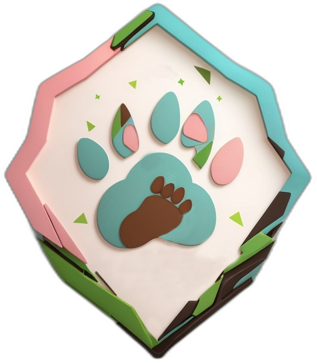

 # PawTales: A Fun and Educational Web App for Kids 


PawTales is a delightful web app built with React and Vite, designed to entertain and educate children about the wonderful world of animals. Our aim is to foster a love for animals and promote their protection from a young age. With engaging stories and interactive features, PawTales is the perfect place for kids to explore and learn.

## Technologies Used

PawTales is made possible by using the following technologies:

- **React**: A powerful JavaScript library for building user interfaces.

- **Vite**: A fast and efficient build tool for React projects.

- **SCSS**: A CSS pre-processor used for styling, making the app visually appealing.

- **Email.js**: A library for sending emails. We use it to make communication easy and efficient.

- **Axios**: A promise-based HTTP client for fetching data from external sources.

- **Firebase**: A suite of tools that includes authentication, database, and storage for images. Firebase helps us manage user accounts and store data securely.

- **Framer Motion**: This library adds delightful animations to the app, making the stories come to life.

- **React-Share**: With this library, kids can share their favorite stories and characters on social media, spreading the love for animals.

## Getting Started

To get started with PawTales, follow these steps:

1. **Clone the Repository**:
```
git clone https://github.com/Michalis-Mel/PawTales.git
```

2. **Install Dependencies**:
```
cd PawTales
npm install
```

3. **Run the Development Server**:

```
npm run dev
```

4. **Open the App**:
   Once the server is running, open your browser and navigate to http://localhost:5173.

## Contributing

We welcome contributions from the community to make PawTales even better. Whether it's fixing bugs, adding new features, or improving the user experience, we're open to collaboration.

## License

PawTales is licensed under the <a href="https://github.com/Michalis-Mel/PawTales/blob/main/LICENSE">MIT License</a>, which means you can use, modify, and distribute it freely. However, we appreciate giving credit to the project.

## Thank you

Thank you for being a part of PawTales and for your commitment to educating and entertaining kids while fostering their love and protection of animals. 🐶🐱🐰🦁

For any questions or suggestions, please feel free to reach out to us.
